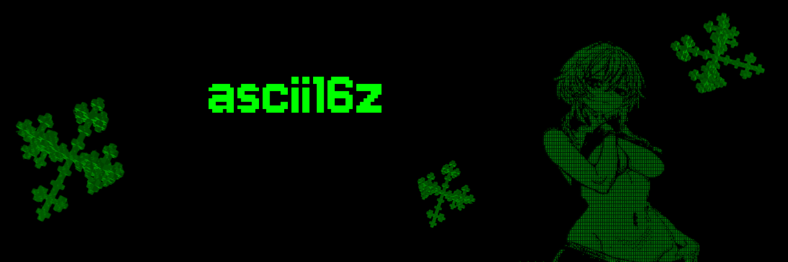

# ascii16z 🤖

<div align="center">
  
</div>

<div align="center">

ASCII art generation made easy with the power of ChatGPT!

</div>

---

## 🚩 Overview

**ascii16z** is a forked project focused on generating ASCII art using the ChatGPT API and an ASCII converter pipeline. It started as a fork from another project, but has been tailored to provide a streamlined environment for creating, customizing, and sharing ASCII artwork in various contexts.

Whether you’re looking to build an ASCII-art chatbot, generate ASCII logos, or embed ASCII designs in your applications, **ascii16z** simplifies the process by handling model connections and ASCII conversion under the hood.

---

## ✨ Features

- **Powered by ChatGPT** – Automate ASCII art generation using ChatGPT’s robust text-completion abilities.
- **Flexible ASCII Converter** – Instantly transform any text (or even images, if integrated) into ASCII designs.
- **Easy Setup** – Minimal dependencies and a straightforward environment to get you started quickly.
- **Extensible** – Create custom prompts, add new ASCII styles, or connect to other generative models as needed.
- **Community Friendly** – Fork and adapt the source for your own ASCII-based projects with ease.

---

## 🎯 Use Cases

- **ASCII Art Chatbot** – Integrate a chatbot that returns ASCII-style responses.
- **Banner Generation** – Quickly create ASCII banners or logos for your terminal applications.
- **Social Media Fun** – Convert short messages into ASCII art for more creative posts.
- **Game UIs** – Use ASCII art for retro-styled user interfaces in your text-based or terminal games.
- **Automation Scripts** – Incorporate ASCII generation into your build scripts or notification systems.

---

## 🚀 Quick Start

### Prerequisites

- [Python 2.7+](https://www.python.org/downloads/)  
- [Node.js 23+](https://docs.npmjs.com/downloading-and-installing-node-js-and-npm)  
- [pnpm](https://pnpm.io/installation)

> **Note for Windows Users:** We recommend using [WSL 2](https://learn.microsoft.com/en-us/windows/wsl/install-manual) for a smoother experience.

### 1. Clone ascii16z

```bash
git clone https://github.com/your-username/ascii16z.git
cd ascii16z


### 2. Create and Edit the .env File

Copy the example environment file and fill in the relevant details (e.g., your OpenAI API key):

```bash
cp .env.example .env
```

If you need to provide different credentials or run multiple configurations, you can create additional `.env` files and specify them when launching.

### 3. Install and Build

```bash
pnpm install
pnpm build
```

### 4. Start the Agent

```bash
pnpm start
```

Once running, you can interact with ascii16z via any configured interfaces or directly in your terminal. Check the output logs to see how to access or test your ASCII art generation endpoint.

---

## 🖥️ Usage Examples

Below are a few ways you might interact with **ascii16z**:

### Terminal-based Prompt

1. **Start the agent** (if not already running):
   ```bash
   pnpm start
   ```
2. **Enter your prompt** when prompted or via a CLI argument. For example:
   ```sql
   > Please convert "Hello World" into ASCII art.
   ```
3. **Output**:
  <div align="center">
      
   </div>

### Integrating in Scripts

```js
// example.js
const axios = require("axios");

async function generateAsciiArt(textPrompt) {
  try {
    const response = await axios.post("http://localhost:3000/generate", {
      prompt: textPrompt,
    });
    console.log(response.data.asciiArt);
  } catch (error) {
    console.error(error);
  }
}

generateAsciiArt("ASCII16Z is awesome!");
```

---

## 🛠️ Customization

### Character / Agent Configuration:

- Adjust the agent's prompting style, ASCII fonts, or language preferences.
- Customize how the ASCII converter transforms text (e.g., using different fonts or conversions).

### Environment Variables:

- Manage your OpenAI API keys and other secrets in the `.env` file.
- Use multiple `.env` files if you plan on running different configurations simultaneously.

### Extending with Plugins:

- If you need more advanced functionalities (e.g., image-to-ASCII conversions), you can create or install plugins to handle additional workflows.

---

## 🧩 Additional Requirements

If you’d like to process images or need advanced image-based ASCII conversions, make sure to install [Sharp](https://sharp.pixelplumbing.com/) or similar libraries:

```bash
pnpm install --include=optional sharp
```

Refer to our **Documentation** (TODO: Link your docs) for more advanced or custom setups.

---

## 🌐 Community & Contact

- **GitHub Issues** – [Open an issue](https://github.com/your-username/ascii16z/issues) for bug reports or feature requests.
- **Discord** – Join our [ascii16z Discord Server](https://discord.gg/ai16z) to connect, share ASCII art, or get real-time help from the community.

---

## 📜 License

This project inherits its license from the original fork. See [LICENSE](./LICENSE) for more details.

---

## 🙌 Contributors

Thanks to all who have contributed (directly or indirectly) to this project!

<a href="https://github.com/your-username/ascii16z/graphs/contributors">
  
</a>

---

## ⭐ Star History

If you like **ascii16z**, consider giving us a star on GitHub!

---

Happy ASCII-Generating! Feel free to open issues or pull requests. We look forward to your contributions and feedback.
```
